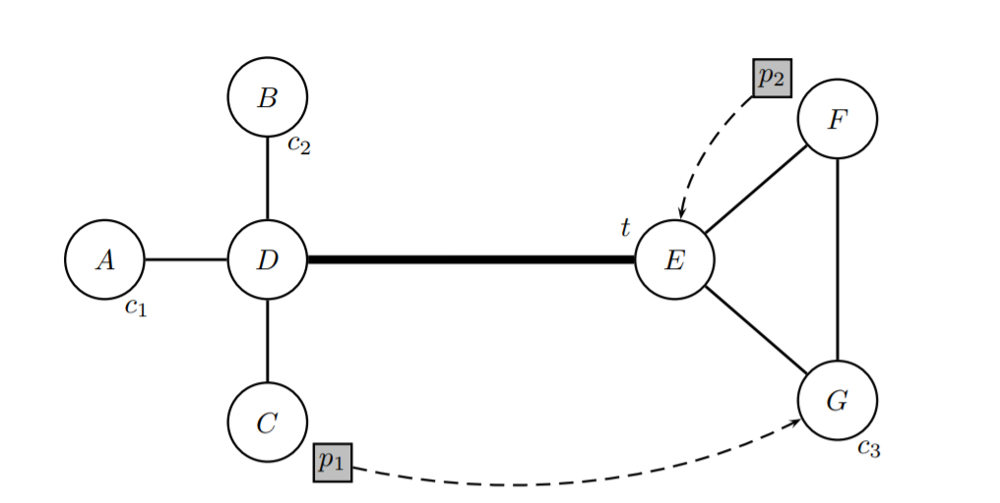
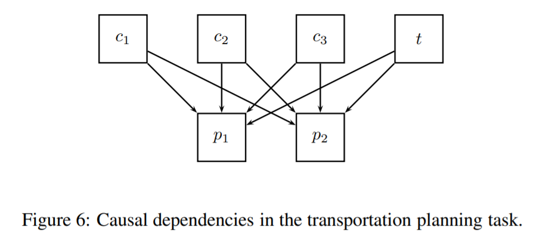
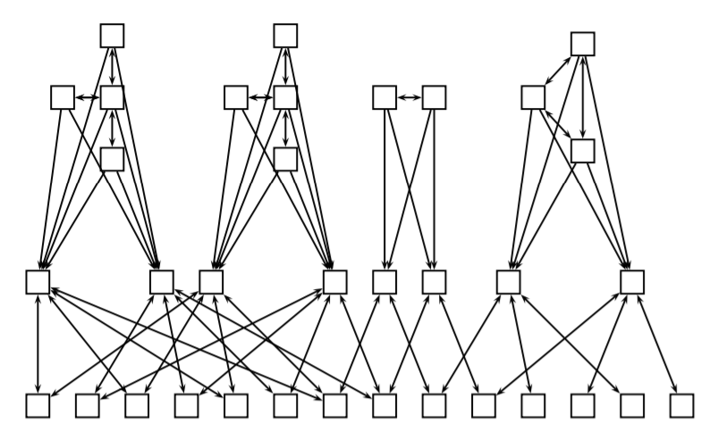
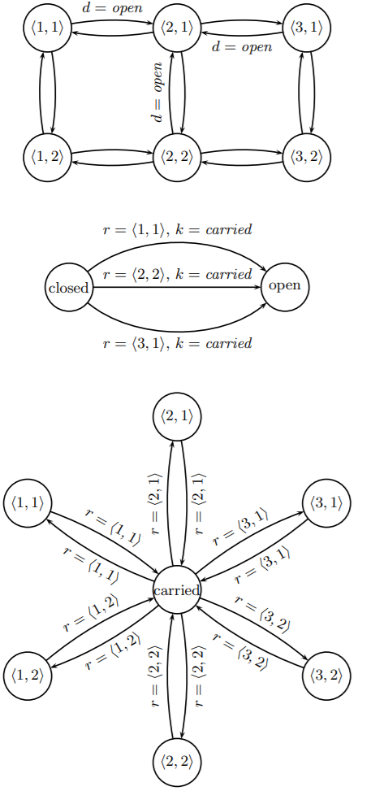

# PDDL-cw

# FD understanding
[original paper](https://ai.dmi.unibas.ch/papers/helmert-dissertation.pdf)
FD is a planner which relies on 2 concepts:
1. **causal graph**: intuitively, as humans, we tend to approach problems in a hierarchical fashion. Imagine the 2 cities problem:
    

    the most intuitive way for us to consider the problem is creating this abstraction:

    

    This is a causal graph, meaning that each **target** depends on a **source**, so there is a causal dependency.

2. **multi-value variables** (SAT): the above represented causal graph is what a human would abstract the problem, but using STRIPS (aka boolean variables) would result in this graph:

    

    This more complex graph is due to the fact that each variable can have many representations.
    > e.g. car1 has 4 prepositions: at A, at B, at C at D even though only one of them can and must be true at the same time.
    
    Beside adding complexity and increasing the search space, it created cycles within the graph which lead to the impossibility of solving the problem.

    > **Remember:** as we are approaching this problem in a hierarchical fashion,  if the causal graph of a planning task exhibits a cycle, hierarchical decomposition is not possible, because the subtasks that must be solved to achieve an operator precondition are not necessarily smaller than the original task.

The process used in FD is composed by 3 ordered steps:
1. The **translation** component is responsible for transforming the PDDL2 input into a non-binary form which is more amenable to hierarchical planning approaches.
    
2. The **knowledge compilation** component generates four kinds of data structures that play a central role during search: 
   - *Domain transition graphs* encode how, and under what conditions, state variables can change their values. 
   - The *causal graph* represents the hierarchical dependencies between the different state variables. 
   - The *successor generator* is an efficient data structure for determining the set of applicable operators in a given state. 
   - Finally, the *axiom evaluator* is an efficient data structure for computing the values of derived variables. 

    The knowledge compilation component is described in Chapter 11.
 
3. The **search component** implements three different search algorithms to do
the actual planning.

----

The DTG for a state variable encodes under what circumstances that variable can change its value, i. e., from which values in the domain there are transitions to which other values, which operators or axioms are responsible for the transition, and which conditions on other state variables are associated with the transition.

Where **DTG** encode dependencies between **values for a given state variable**, the **causal graph** encodes dependencies between **different state variables**.

The causal graph heuristic requires causal graphs to be acyclic, a requirement which is rarely satisfied in practice. For this reason, the knowledge compilation component also generates an acyclic subgraph of the real causal graph when cycles occur.

# How the $h^{cg}$ is calculated
Imagine a grid domain 3 x 2 with a robot starting at (1, 1), a key at (3, 2) and a door at (2, 1) to be opened with such key. The 3 DTGs should look like this:

Consider an initial state where the robot is at location ⟨1, 1⟩, the key is at location ⟨3, 2⟩, and the door is locked. We represent this by placing pebbles on the appropriate vertices of the three domain transition graphs. We want to move the pebble in the domain transition graph of the key to location ⟨2, 1⟩. This can be done by moving the robot pebble to vertex ⟨1, 2⟩, then ⟨2, 2⟩, then ⟨3, 2⟩, moving the key pebble to the vertex carried, moving the robot pebble back to vertex ⟨2, 2⟩, moving the door pebble to open, moving the robot pebble to vertex ⟨2, 1⟩ and finally moving the key pebble to vertex ⟨2, 1⟩.

Causal graph heuristic computes its heuristic estimates by solving subtasks of the planning task by looking for paths in domain transition graphs pretty much like described above.

For variables without predecessors in the causal graph, $cost_v$($d$, $d'$) simply equals the cost of a shortest path from $d$ to $d'$ in the (pruned) domain transition graph DTG($v$)

# Dead ends an $h^{cg}$ = $\infty$
We noted that Fast Downward uses an incomplete planning algorithm for determining solutions to local planning tasks. Therefore, there can be states s with costv(s(v), s⋆(v)) = $\infty$ even though the goal condition v = s⋆(v) can still be reached. This means that we cannot trust infinite values returned by the causal graph heuristic. In our experience, **states with infinite heuristic evaluation** from which it is still possible to reach the goal are rare, so **we indeed treat such states as dead ends**.

If it turns out that all states at the search frontier are dead ends, we cannot make further progress with the causal graph heuristic. In this case, we use a sound dead-end detection routine to verify the heuristic assessment.

# Questions

**1) Why does h add find so many dead ends?**
> Due to the way the hcg operates, finding dead end is fairly trivial, the issue is actually the opposite, that is, false dead ends (h = $\infty$) can wrongly identified as real dead ends. When this happens, the algorithm is forced to run a check and, eventually, to use the FF heuristics, which is complete, although it takes longer.
> In essence, the algorithm, due to the use of DTGs and the causal graph, is very likely to find dead ends, but is not able to identify and seeks for help.

**2) Why does it take longer to hcg to find the solution?**
> Like mentioned before, the heuristic may bump into what it reputes being dead ends. For such reason it has to run again the algorithm using a more expensive but sound heuristic.
> Also, being a hierarchical representation of the world (but I assume the same should be valid for h add), the planner is forced to add constraints which slow down the execution.

**3) Why is h add not able to find the best solutions?**
> Like mentioned in the lecture by Tommy, h add is not always able to find the less expensive path from a state to another, and the heuristic is actually not admissible some time. This should result in a pruning of states which not only are valid but are even better the chosen ones.
