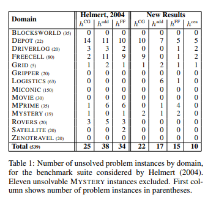

# Inital Analysis
Graphs and data pulled from 24/11 google doc sheet

## Movie domain not fit for comparison
Consistant performance from CG and ADD throughout. Likely due to simple domain

Time difference too small to draw any conclusions

## CG on Depot consistantly performs the same or better

CG Takes longer to reach these better plans though (To be expected)

## CG Consistantly expands more states

## Pathways domain not suitable as no solution was found in any problem for both heuristics

## Blocks is an interesting domain, CG often beats ADD, but CG fails on some

## Freecell another interesting domain, maybe need further testing/analysis

## We have different results to the Helmert 2004 paper

This is likely due to a number of factors. We have tested less problem files and we have a greater time limit. Not to mention computing capacity and memory

## Summary of Analysis

Data used: *results-30-mins-temp*

### Key findings:
* For the instances which are solved by both Add and CG, CG is able to find solutions quicker in most domains (exception: depot).
* CG is consistently able to produce shorter plan lengths
* CG has higher peak memory values - high instantaneous memory usage, does not indicate overall memory usage
* Number of unsolved instances, dead ends and evaluations remain domain specific

